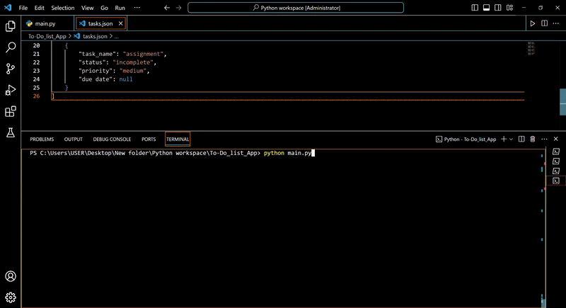
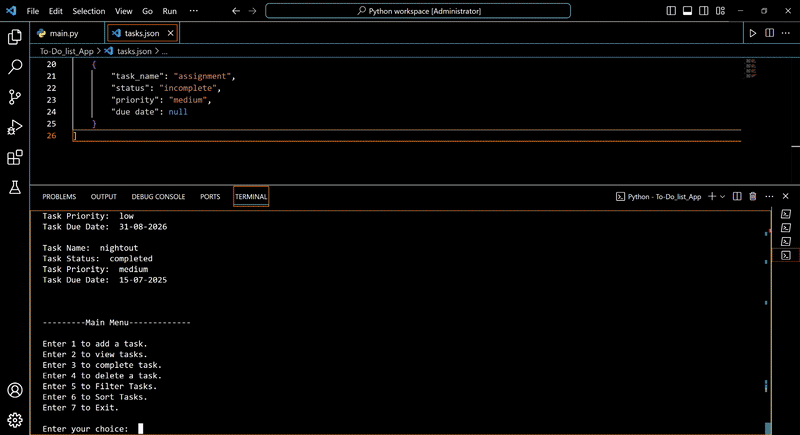

# Python Project: Console To-Do List Manager 🚀

## Project Overview

Welcome to my Python project, a simple yet powerful console-based To-Do List Manager! 👋

As a beginner in Python, this project was a fantastic journey into understanding core programming concepts and building a practical application from scratch. It's designed to help users efficiently manage their daily tasks, ensuring nothing gets missed. This application runs entirely in your terminal, providing a straightforward and intuitive experience.

Through this project, I've focused on solidifying my Python fundamentals and embracing best practices like code modularity and robust error handling.

## Key Features ✨

This To-Do List application comes packed with essential functionalities to keep you organized:

* **Add New Tasks:** Easily add new tasks to your list, including a **name, status (incomplete by default), priority (high/medium/low), and an optional due date (DD-MM-YYYY format).**
* **View All Tasks:** Get a clear overview of all your tasks, neatly with their current status (`completed`/`incomplete`), priority, and due date.
* **Mark Tasks Complete:** Mark any task as `complete` by simply entering its name.
* **Delete Tasks:** Remove unwanted tasks from your list with a quick command.
* **Intuitive Menu System:** A clear, interactive menu guides you through all available options.
* **Robust Input Handling:** Designed to handle invalid user inputs gracefully, ensuring the application remains stable and user-friendly.
* **Persistent Storage:** **Tasks are automatically saved to and loaded from a `tasks.json` file, ensuring your data is not lost when the application closes.**
* **Filtering Options:**
    * **Filter tasks by their `Status`** (display only `completed` or `incomplete` tasks).
    * **Filter tasks by their `Priority`** (display tasks marked `high`, `medium`, or `low`).
* **Advanced Sorting:**
    * **Sort tasks by `Priority`:** Organize your list with `high` priority tasks appearing before `medium`, and `medium` before `low`.
    * **Sort tasks by `Due Date`:** Chronologically order your tasks by their due dates, with tasks without a due date intelligently placed at the end.

### What I Learned & Refactored 🧠

This project was a huge learning curve, and I'm particularly proud of the following improvements I implemented:

* **Reusable Input Function:** Instead of repeating `input()` calls and their associated validation logic everywhere, I created a dedicated function. This significantly reduces code duplication and makes the code cleaner.
* **Modular Task Existence Check (`isTaskPresent`):** I abstracted the logic for checking if a task exists in the list into its own function. This makes the `complete_task()` and `delete_task()` functions much more readable and focused on their primary responsibilities.
* **Enhanced Error Handling:** Implemented `try-except` blocks, especially for user choices, to catch `ValueError` if a non-integer input is provided, guiding the user with helpful messages instead of crashing.
* **JSON Data Persistence:** Gained hands-on experience with `json` module for reading and writing structured data to files, making the application's data persistent across sessions.
* **Advanced List Manipulation:** Mastered techniques for adding, updating, filtering, and sorting complex data structures (lists of dictionaries) based on specific criteria.
* **Custom Sorting with `lambda`:** Learned to use `lambda` functions with `list.sort()` to implement custom sorting logic based on priority and dynamic due dates.
* **Date & Time Handling:** Utilized the `datetime` module to parse date strings into `datetime` objects for accurate chronological sorting and gracefully handled tasks with no due dates.

## Application Demo / Quick Demo 🎥

### Main Menu and Adding a Task

*A quick look at the interactive menu and adding a new task.*


### Filtering Tasks

*See how tasks can be filtered by status/priority*

### Sorting Tasks

*See how tasks can be sorted by priority/due date*


## Technologies Used 🛠️

* **Python 3 or above**
* **JSON:** For data storage and retrieval.
* **`datetime` module:** For robust handling and chronological sorting of dates.

## How to Run the Application 🏃‍♀️

Getting started with the To-Do List Manager is easy!

1.  **Prerequisites:** Ensure you have Python 3 or above installed on your system. If not, you can download it from the [official Python website](https://www.python.org/downloads/).
2.  **Download the Code:**
    * Clone this repository: `git clone https://github.com/MoizaA17/my-todo-app.git`
    * Or, download the ZIP file directly from GitHub.
3.  **Navigate to the Project Directory:** Open your terminal or command prompt and navigate to the folder where you've saved the `main.py` file.
    ```bash
    cd path/to/your/project_folder
    ```
4.  **Execute the Application:** Run the application using the Python interpreter:
    ```bash
    python main.py
    ```
    Follow the on-screen menu to manage your tasks!


## Author 👩‍💻

* **MoizaA17** - Connect with me on [GitHub](https://github.com/MoizaA17)!

---
